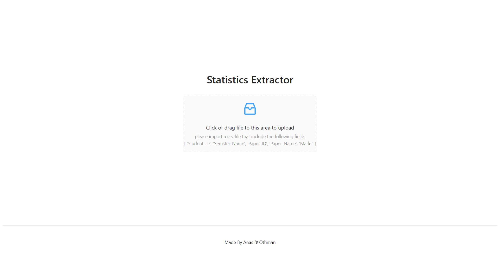
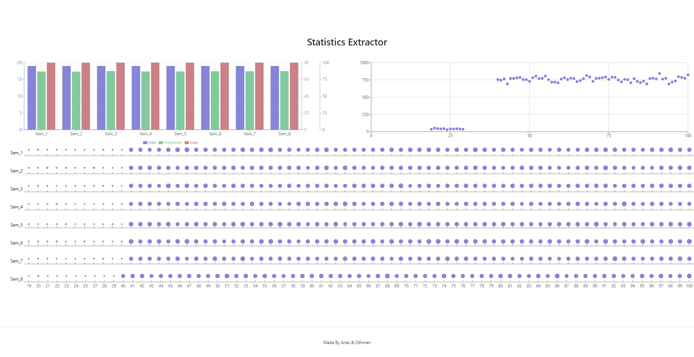

## Simple Statistics Extractor

Is a NextJs project that made as POC on a study that requested by our university of how we can upload a simple csv file and do some statistics on it.
<br />
<br />
PS: The CSV file must contain the following columns : 'Student_ID', 'Semster_Name', 'Paper_ID', 'Paper_Name', 'Marks'






## Run Steps

```bash
git clone https://github.com/anasmassnaoui/Simple-Statistics-Extractor.git
cd Simple-Statistics-Extractor
npm install
npm run dev
```

Open [http://localhost:3000](http://localhost:3000) with your browser to see the result.
